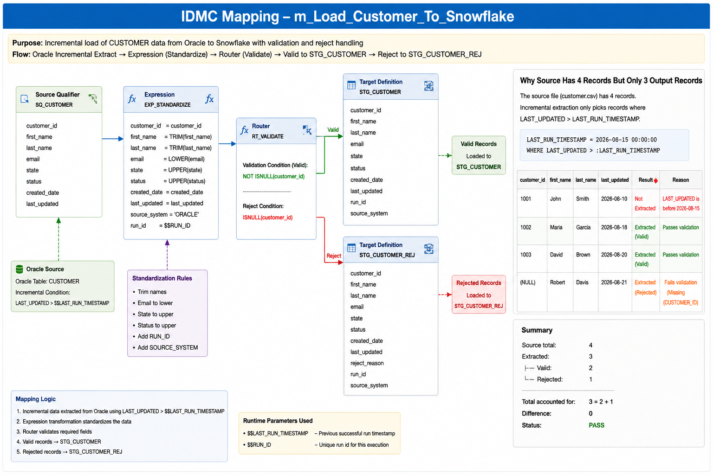

# Informatica IDMC + Snowflake ETL Pipeline

End-to-end ETL portfolio project demonstrating incremental data integration from **Oracle → Informatica IDMC → Snowflake**.

The project demonstrates a practical enterprise-style ETL workflow including incremental extraction, transformation, data validation, reject handling, Snowflake staging, SCD Type 2 processing, ETL run control, reconciliation, and production-support concepts.

---

## Architecture

```text
Oracle CUSTOMER
      |
      | Incremental Extract
      | LAST_UPDATED > LAST_RUN_TIMESTAMP
      v
Informatica IDMC
      |
      | Source
      | Expression
      | Data Validation
      | Router
      |
      +----------------------+
      |                      |
      v                      v
VALID_RECORDS          REJECT_RECORDS
      |                      |
      v                      v
STG_CUSTOMER        STG_CUSTOMER_REJ
      |
      v
SCD Type 2 Processing
      |
      v
DIM_CUSTOMER
      |
      v
Reconciliation
      |
      v
ETL_RUN_CONTROL
      |
      v
PASS / FAIL
```

---

## IDMC Mapping

The IDMC mapping performs incremental extraction, data standardization, validation, and routing of valid and rejected customer records.



The mapping demonstrates the complete processing flow:

```text
Oracle CUSTOMER
      |
      | Incremental Filter
      | LAST_UPDATED > LAST_RUN_TIMESTAMP
      v
IDMC Source
      |
      v
Expression
      |
      | Standardize values
      | Add ETL metadata
      v
Data Validation
      |
      v
Router
     / \
    /   \
   v     v
VALID   REJECT
  |       |
  v       v
STG_    STG_CUSTOMER_REJ
CUSTOMER
```

For the sample run:

```text
Oracle Source Records = 4
        |
        v
Incremental Filter
        |
        | 1001 John filtered out
        v
Extracted Records = 3
        |
        v
IDMC Mapping
       / \
      /   \
     v     v
 VALID   REJECT
   2       1
```

Therefore:

```text
3 extracted = 2 loaded + 1 rejected
```

---

## Technologies

| Area | Technology |
|---|---|
| Data Integration | Informatica IDMC / IICS |
| Source Database | Oracle |
| Cloud Data Warehouse | Snowflake |
| Development | SQL / PL/SQL |
| ETL Pattern | Incremental Load |
| Data Warehousing | SCD Type 2 |
| Data Quality | Validation & Reject Handling |
| Audit & Control | RUN_ID / ETL_RUN_CONTROL |
| Production Support | Reconciliation, Monitoring & RCA |

---

## Sample ETL Run

The example uses the following previous successful run timestamp:

```text
LAST_RUN_TIMESTAMP = 2026-08-15 00:00:00
```

Oracle CUSTOMER contains:

| CUSTOMER_ID | FIRST_NAME | STATE | STATUS | LAST_UPDATED |
|---:|---|---|---|---|
| 1001 | John | il | active | 2026-08-10 |
| 1002 | Maria | in | active | 2026-08-18 |
| 1003 | David | oh | inactive | 2026-08-20 |
| NULL | Robert | in | active | 2026-08-21 |

The incremental extraction condition is:

```sql
WHERE LAST_UPDATED > :LAST_RUN_TIMESTAMP
```

Customer `1001` is filtered out because the record was last updated before the previous successful ETL run.

Therefore:

```text
4 Oracle records
        |
        v
Incremental Filter
        |
        v
3 records extracted
```

The extracted records are:

| Customer | LAST_UPDATED | ETL Result |
|---|---|---|
| 1002 Maria | Aug 18 | Extracted → VALID |
| 1003 David | Aug 20 | Extracted → VALID |
| NULL Robert | Aug 21 | Extracted → REJECT |

---

## IDMC Mapping Processing

The IDMC mapping used in this project is:

```text
m_Load_Customer_To_Snowflake
```

### Expression Transformation

Incoming values are standardized before validation.

Example:

```text
FIRST_NAME    = TRIM(FIRST_NAME)
STATE         = UPPER(STATE)
STATUS        = UPPER(STATUS)
SOURCE_SYSTEM = 'ORACLE'
```

Example transformation:

```text
Before                     After

" Maria "                  Maria
in                         IN
active                     ACTIVE
```

### Router Validation

The Router separates valid and rejected records.

Valid condition:

```text
NOT ISNULL(CUSTOMER_ID)
```

Reject condition:

```text
ISNULL(CUSTOMER_ID)
```

Result:

| Customer | Result | Destination |
|---|---|---|
| 1002 Maria | VALID | STG_CUSTOMER |
| 1003 David | VALID | STG_CUSTOMER |
| NULL Robert | REJECT | STG_CUSTOMER_REJ |

Robert is rejected because `CUSTOMER_ID` is missing.

```text
             IDMC INPUT
              3 records
                  |
           +------+------+
           |             |
           v             v
         VALID         REJECT
           2             1
           |             |
           v             v
    STG_CUSTOMER   STG_CUSTOMER_REJ
```

Detailed mapping walkthrough:

➡️ [IDMC Mapping Design](idmc/mapping-design.md)

---

## Snowflake Staging

Valid customer records are loaded into:

```text
STG_CUSTOMER
```

Example:

| CUSTOMER_ID | FIRST_NAME | STATE | STATUS | RUN_ID | SOURCE_SYSTEM |
|---:|---|---|---|---|---|
| 1002 | Maria | IN | ACTIVE | 20260829_020000 | ORACLE |
| 1003 | David | OH | INACTIVE | 20260829_020000 | ORACLE |

Rejected records are written to:

```text
STG_CUSTOMER_REJ
```

Example:

| CUSTOMER_ID | FIRST_NAME | STATE | REJECT_REASON | RUN_ID |
|---|---|---|---|---|
| NULL | Robert | IN | Missing CUSTOMER_ID | 20260829_020000 |

Keeping the rejected source record allows the issue to be investigated, corrected, and potentially reprocessed.

---

## SCD Type 2 Processing

Customer history is preserved in:

```text
DIM_CUSTOMER
```

Instead of overwriting historical information, changed customer attributes create a new dimension version.

Example:

```text
Before change

CUSTOMER_ID   STATE   IS_CURRENT
1002          IL      TRUE
```

If customer `1002` moves from Illinois to Indiana:

```text
After change

CUSTOMER_ID   STATE   IS_CURRENT
1002          IL      FALSE
1002          IN      TRUE
```

The old record is closed and the new version becomes the current record.

This preserves customer history for reporting and analytics.

---

## ETL Reconciliation

Every record extracted from the source must be accounted for as either successfully loaded or rejected.

Sample run:

```text
RUN_ID      = 20260829_020000

SOURCE      = 3
LOADED      = 2
REJECTED    = 1
DIFFERENCE  = 0

STATUS      = PASS
```

Reconciliation rule:

```text
SOURCE = LOADED + REJECTED
```

For this run:

```text
3 = 2 + 1
```

Difference:

```text
DIFFERENCE = SOURCE - (LOADED + REJECTED)

DIFFERENCE = 3 - (2 + 1)
           = 0
```

Therefore:

```text
STATUS = PASS
```

If the difference is not zero, the run requires investigation.

Detailed validation SQL:

➡️ [Reconciliation](validation/reconciliation.sql)

➡️ [Data Quality Checks](validation/data_quality_checks.sql)

---

## ETL Run Control

Each ETL execution is identified by a unique `RUN_ID`.

Example:

```text
RUN_ID = 20260829_020000
```

The `ETL_RUN_CONTROL` table stores execution-level information such as:

- RUN_ID
- process name
- start timestamp
- end timestamp
- previous successful run timestamp
- source count
- loaded count
- rejected count
- difference count
- status
- error information

Typical execution:

```text
START
  |
  v
Create RUN_ID
  |
  v
Insert ETL_RUN_CONTROL
STATUS = RUNNING
  |
  v
Oracle Incremental Extract
  |
  v
IDMC Mapping
  |
  +------------------+
  |                  |
  v                  v
VALID              REJECT
  |                  |
  v                  v
STG_CUSTOMER    STG_CUSTOMER_REJ
  |
  v
SCD Type 2
  |
  v
Reconciliation
  |
  +------------------+
  |                  |
  v                  v
PASS               FAIL
  |                  |
  +--------+---------+
           |
           v
Update ETL_RUN_CONTROL
```

The previous successful timestamp should only advance after a successful ETL run.

---

## IDMC Taskflow

The taskflow represents the orchestration layer for the complete process.

Example taskflow:

```text
tf_Customer_Oracle_To_Snowflake
```

It demonstrates:

- RUN_ID generation
- previous successful timestamp retrieval
- Oracle incremental extraction
- IDMC mapping execution
- validation and reject handling
- SCD Type 2 processing
- reconciliation
- success/failure handling
- ETL run-control updates
- restart/reprocessing concepts

Detailed design:

➡️ [IDMC Taskflow Design](idmc/taskflow-design.md)

---

## Sample Input and Expected Output

The repository includes synthetic sample data so the processing logic can be followed from source to expected target results.

### Source

➡️ [Oracle Customer Sample](sample-data/source/customer.csv)

### Expected Valid Output

➡️ [Expected STG_CUSTOMER](sample-data/expected/stg_customer.csv)

### Expected Reject Output

➡️ [Expected STG_CUSTOMER_REJ](sample-data/expected/stg_customer_rej.csv)

Example result:

```text
SOURCE
4 records
    |
    v
Incremental Filter
3 records
    |
    v
IDMC
    |
 +--+--+
 |     |
 v     v
2     1
VALID REJECT
 |     |
 v     v
STG   STG_REJ

Reconciliation:
3 = 2 + 1

PASS
```

---

## Repository Structure

```text
informatica-idmc-snowflake-etl/
│
├── images/
│   └── idmc-customer-mapping.png
│
├── oracle/
│   ├── create_customer.sql
│   └── incremental_extract.sql
│
├── idmc/
│   ├── mapping-design.md
│   └── taskflow-design.md
│
├── snowflake/
│   ├── create_stage_tables.sql
│   ├── create_reject_table.sql
│   ├── create_dimension.sql
│   ├── merge_customer.sql
│   ├── create_etl_run_control.sql
│   └── update_etl_run_control.sql
│
├── validation/
│   ├── reconciliation.sql
│   └── data_quality_checks.sql
│
├── sample-data/
│   ├── README.md
│   │
│   ├── source/
│   │   └── customer.csv
│   │
│   └── expected/
│       ├── stg_customer.csv
│       └── stg_customer_rej.csv
│
└── README.md
```

---

## Key ETL Concepts Demonstrated

- Oracle source extraction
- Incremental loading using timestamps
- Informatica IDMC mapping design
- Expression transformations
- Data standardization
- Router-based validation
- Reject/error handling
- Snowflake staging
- SCD Type 2 dimensional processing
- Source-to-target reconciliation
- RUN_ID-based processing
- ETL audit/control tables
- Data-quality validation
- Taskflow orchestration
- ETL restart and recovery concepts
- Production monitoring
- Root-cause analysis

---

## Production Support Scenario

If an ETL run fails reconciliation, the investigation can follow the `RUN_ID` across the process.

For example:

```text
RUN_ID = 20260829_020000
```

Check:

```text
1. Source extract count
2. STG_CUSTOMER count
3. STG_CUSTOMER_REJ count
4. Validation/reject reasons
5. Reconciliation difference
6. ETL_RUN_CONTROL status
```

This provides a simple audit trail for troubleshooting and root-cause analysis.

---

## About This Project

This is a simplified portfolio implementation based on common enterprise ETL and data-engineering patterns.

The project is designed to demonstrate practical understanding of how Oracle, Informatica IDMC, and Snowflake can work together in an incremental data pipeline with validation, audit controls, historical processing, and production-support considerations.

All customer data, table names, RUN_ID values, timestamps, and examples are **synthetic and created specifically for demonstration purposes**.

No proprietary production code, credentials, customer information, or company data is included.
